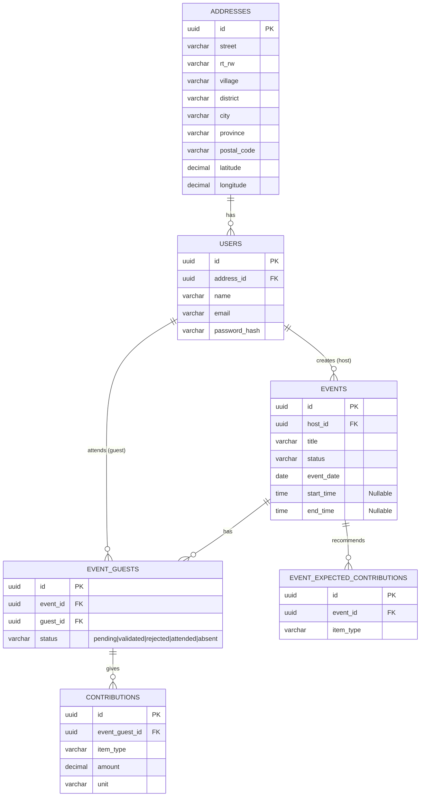

# BuwohApp Database Schema

Dokumen ini berisi rancangan struktur tabel database relasional untuk mendukung [API_CONTRACT.md](./API_CONTRACT.md). Desain ini berfokus pada normalisasi data, integritas relasional, dan dirancang agar *scalable* (mudah diskalakan) seiring dengan pertumbuhan data di masa depan.

## Prinsip Skalabilitas & Arsitektur
1. **UUID sebagai Primary Key**: Menggunakan UUID (v4) untuk Primary Key guna menghindari *ID guessing*, mendukung *distributed databases* atau *sharding* di masa depan, dan mempermudah migrasi data.
2. **Audit Trails (Soft Delete)**: Setiap tabel utama memiliki kolom `created_at`, `updated_at`, dan `deleted_at`. `deleted_at` digunakan untuk *soft deletes*, sehingga data riwayat tidak benar-benar hilang (sangat penting untuk aplikasi pencatatan kontribusi seperti ini).
3. **Normalisasi Data Alamat**: Memisahkan entitas alamat secara detail ke dalam tabel tersendiri untuk mempermudah analitik geografis dan pencarian terdekat (*geolocation*).
4. **Pemisahan Entitas Kontribusi**: Item buwoh (Uang, Beras, Gula) tidak disimpan sebagai kolom statis, melainkan pada tabel `contributions` terpisah. Ini memungkinkan aplikasi menambahkan jenis buwoh baru di masa depan.
5. **Preferensi/Harapan Buwoh**: Menyediakan tabel spesifik agar *Host* dapat mendefinisikan ekspektasi jenis buwoh tanpa ada ikatan validasi yang memberatkan tamu (fleksibel).

---

## 1. Tabel `addresses`
Menyimpan data alamat secara detail (standar Indonesia) dan koordinat spasial. Dapat digunakan oleh *User* maupun entitas lain jika dibutuhkan.

| Kolom | Tipe Data | Constraint | Deskripsi |
| :--- | :--- | :--- | :--- |
| `id` | UUID | PRIMARY KEY | ID unik alamat |
| `street` | VARCHAR(255) | NULL | Nama jalan, gedung, blok |
| `rt_rw` | VARCHAR(20) | NULL | Format RT/RW (ex: 001/002) |
| `village` | VARCHAR(100) | NULL | Desa / Kelurahan |
| `district` | VARCHAR(100) | NULL | Kecamatan |
| `city` | VARCHAR(100) | NULL | Kabupaten / Kota |
| `province` | VARCHAR(100) | NULL | Provinsi |
| `postal_code`| VARCHAR(10) | NULL | Kode Pos |
| `latitude` | DECIMAL(10,8)| NULL | Titik lintang koordinat |
| `longitude` | DECIMAL(11,8)| NULL | Titik bujur koordinat |
| `created_at` | TIMESTAMP | DEFAULT NOW() | Waktu rekam dibuat |
| `updated_at` | TIMESTAMP | DEFAULT NOW() | Waktu rekam diubah |

---

## 2. Tabel `users`
Menyimpan informasi autentikasi dan profil pengguna (baik sebagai *Host* maupun *Guest*).

| Kolom | Tipe Data | Constraint | Deskripsi |
| :--- | :--- | :--- | :--- |
| `id` | UUID | PRIMARY KEY | ID unik pengguna |
| `address_id` | UUID | FK (addresses.id) | Referensi ke tabel alamat |
| `name` | VARCHAR(255) | NOT NULL | Nama lengkap |
| `email` | VARCHAR(255) | UNIQUE, NOT NULL| Email untuk login |
| `password_hash` | VARCHAR(255) | NOT NULL | Hash password |
| `birth_date` | DATE | NULL | Tanggal lahir |
| `photo_url` | VARCHAR(512) | NULL | URL foto profil |
| `created_at` | TIMESTAMP | DEFAULT NOW() | Waktu pendaftaran |
| `updated_at` | TIMESTAMP | DEFAULT NOW() | Waktu update terakhir |
| `deleted_at` | TIMESTAMP | NULL | Soft delete marker |

**Indexes:**
- `idx_users_email` (email)
- `idx_users_address_id` (address_id)

---

## 3. Tabel `events`
Menyimpan data acara (Hajatan) yang dibuat oleh *Host*.

| Kolom | Tipe Data | Constraint | Deskripsi |
| :--- | :--- | :--- | :--- |
| `id` | UUID | PRIMARY KEY | ID unik acara |
| `host_id` | UUID | FK (users.id) | ID user pembuat acara |
| `title` | VARCHAR(255) | NOT NULL | Judul acara (ex: Aqiqah Budi) |
| `event_type` | VARCHAR(100) | NOT NULL | Jenis (Pernikahan, Khitanan, dll)|
| `event_date` | DATE | NOT NULL | Tanggal acara |
| `start_time` | TIME | NULL | Waktu mulai (opsional) |
| `end_time` | TIME | NULL | Waktu selesai (opsional) |
| `location_name` | VARCHAR(255) | NOT NULL | Nama/Alamat lokasi umum |
| `map_link` | VARCHAR(512) | NULL | URL Google Maps |
| `description` | TEXT | NULL | Deskripsi acara |
| `cover_image_url`| VARCHAR(512) | NULL | URL foto cover acara |
| `status` | VARCHAR(50) | DEFAULT 'active'| active, completed, cancelled |
| `is_priority` | BOOLEAN | DEFAULT false | Flag prioritas/balas budi |
| `created_at` | TIMESTAMP | DEFAULT NOW() | Waktu acara dibuat |
| `updated_at` | TIMESTAMP | DEFAULT NOW() | Waktu update terakhir |
| `deleted_at` | TIMESTAMP | NULL | Soft delete marker |

**Indexes:**
- `idx_events_host_id` (host_id)
- `idx_events_date_status` (event_date, status)

---

## 4. Tabel `event_expected_contributions`
Menyimpan "rekomendasi" atau "harapan" dari *Host* terhadap jenis buwoh yang diinginkan untuk suatu acara.

| Kolom | Tipe Data | Constraint | Deskripsi |
| :--- | :--- | :--- | :--- |
| `id` | UUID | PRIMARY KEY | ID record |
| `event_id` | UUID | FK (events.id) | ID acara terkait |
| `item_type` | VARCHAR(100) | NOT NULL | Jenis harapan (uang, beras, dll)|
| `created_at` | TIMESTAMP | DEFAULT NOW() | Waktu rekam dibuat |

**Indexes:**
- `idx_expected_contributions_event_id` (event_id)

---

## 5. Tabel `event_guests` (Kehadiran & Undangan)
Tabel *pivot* / penghubung antara `events` dan `users` yang bertindak sebagai tamu. Menyimpan status kehadiran dan validasi secara terperinci.

| Kolom | Tipe Data | Constraint | Deskripsi |
| :--- | :--- | :--- | :--- |
| `id` | UUID | PRIMARY KEY | ID kehadiran tamu |
| `event_id` | UUID | FK (events.id) | ID acara yang dihadiri |
| `guest_id` | UUID | FK (users.id) | ID tamu yang hadir |
| `status` | VARCHAR(50) | DEFAULT 'pending'| pending, validated, rejected, attended, absent |
| `time_arrived` | TIMESTAMP | NULL | Waktu tamu check-in (tanda hadir)|
| `created_at` | TIMESTAMP | DEFAULT NOW() | Waktu pengajuan kehadiran |
| `updated_at` | TIMESTAMP | DEFAULT NOW() | Waktu status berubah |
| `deleted_at` | TIMESTAMP | NULL | Soft delete marker |

**Definisi Status:**
- `pending`: Tamu mendaftar namun buwoh belum diproses/disetujui.
- `validated`: Buwoh sudah divalidasi oleh penerima tamu (host).
- `rejected`: Permintaan ditolak (mungkin spam atau data salah).
- `attended`: Menandakan tamu benar-benar hadir secara fisik di lokasi acara.
- `absent`: Menandakan tamu tidak hadir secara fisik (mungkin hanya titip buwoh).

**Indexes:**
- `idx_event_guests_event_id` (event_id)
- `idx_event_guests_guest_id` (guest_id)
- `idx_event_guests_status` (status)

*Catatan: `event_id` dan `guest_id` dibuat UNIQUE constraint secara kombinasi (UNIQUE(event_id, guest_id)) agar satu user tidak bisa mendaftar hadir dua kali di acara yang sama.*

---

## 6. Tabel `contributions` (Rincian Buwoh)
Menyimpan rincian spesifik buwoh/sumbangan aktual yang diberikan tamu. Terhubung langsung ke `event_guests`.

| Kolom | Tipe Data | Constraint | Deskripsi |
| :--- | :--- | :--- | :--- |
| `id` | UUID | PRIMARY KEY | ID kontribusi |
| `event_guest_id` | UUID | FK (event_guests.id)| ID record kehadiran tamu |
| `item_type` | VARCHAR(100) | NOT NULL | Jenis (uang, beras, gula, kado)|
| `amount` | DECIMAL(15,2) | NOT NULL | Nominal/Kuantitas barang |
| `unit` | VARCHAR(50) | NOT NULL | Satuan (IDR, Kg, Pcs) |
| `notes` | VARCHAR(255) | NULL | Catatan khusus (ex: Kipas Angin)|
| `created_at` | TIMESTAMP | DEFAULT NOW() | Waktu input kontribusi |
| `updated_at` | TIMESTAMP | DEFAULT NOW() | Waktu edit (jika ada) |

**Indexes:**
- `idx_contributions_event_guest_id` (event_guest_id)

---

## Diagram Relasi (Entity Relationship)

## Penjelasan Relasi Antar Tabel

1. **`addresses` ke `users` (1-to-Many / 1-to-1):**
   Tabel `addresses` menyimpan entitas data spasial dan hierarki wilayah secara independen. Satu baris alamat (`id`) dirujuk oleh pengguna di tabel `users` melalui *Foreign Key* `address_id`. Normalisasi ini menjaga agar tabel pengguna tetap rapi dan mempermudah query pencarian lokasi.

2. **`users` ke `events` (1-to-Many):**
   Satu pengguna (`users`) dapat bertindak sebagai *Host* dan membuat banyak acara/hajatan (`events`). Relasi ini dibentuk menggunakan kolom `host_id` di dalam tabel `events` yang merujuk ke `users.id`.

3. **`events` dan `users` ke `event_guests` (Many-to-Many):**
   Hubungan antara Acara dan Tamu adalah banyak-ke-banyak (satu acara punya banyak tamu, satu tamu bisa hadir di banyak acara). Tabel `event_guests` memecah relasi ini dengan bertindak sebagai tabel *pivot*. Tabel ini menyimpan `event_id` dan `guest_id` secara bersamaan untuk melacak status pendaftaran dan kehadiran tamu.

4. **`events` ke `event_expected_contributions` (1-to-Many):**
   Satu acara (`events`) dapat memiliki berbagai jenis "Harapan Buwoh" (misal: mengharapkan "uang" sekaligus "sembako"). Tabel `event_expected_contributions` menyimpan daftar harapan ini agar terstruktur rapi per `event_id` tanpa batasan jumlah kolom.

5. **`event_guests` ke `contributions` (1-to-Many):**
   Ketika seorang tamu hadir di acara (tercatat di `event_guests`), ia dapat membawa lebih dari satu jenis buwoh secara bersamaan (misal: memberikan amplop uang dan membawa bingkisan kado). Setiap rincian barang tersebut dicatat sebagai baris terpisah di tabel `contributions` dengan merujuk pada `event_guest_id`. Desain ini sangat fleksibel untuk menampung jenis sumbangan yang bervariasi.
